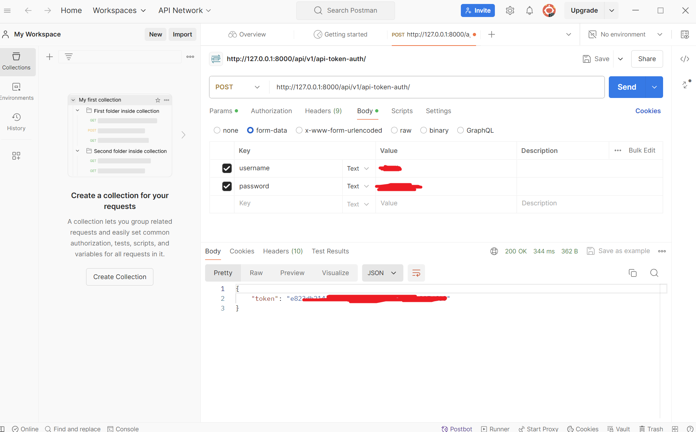

# Как запустить на ПК

Выбираем, куда будем кланировать (например на диск B в папку TEST_PROJECT)

```bash
cd /B/TEST_PROJECT
```

Клонируем проект:

```bash
git clone https://github.com/Vettel12/api_yatube-master
```

Устанавливаем виртуальное окружение:

```bash
python -m venv venv
```

Активируем виртуальное окружение:

```bash
source venv/Scripts/activate
```

> Для деактивации виртуального окружения выполним (после работы):
> ```bash
> deactivate
> ```

Устанавливаем зависимости:

```bash
python -m pip install --upgrade pip
```
```bash
pip install -r requirements.txt
```

Применяем миграции:

```bash
python yatube/manage.py makemigrations
python yatube/manage.py migrate
```

Для запуска тестов выполним:

```bash
pytest
```

Получим:

```bash
tests/test_auth.py::TestAuthAPI::test_auth PASSED                                                                                               [  6%]
tests/test_comment.py::TestPostAPI::test_comments_not_found PASSED                                                                              [ 13%]
tests/test_comment.py::TestPostAPI::test_comments_get PASSED                                                                                    [ 20%]
tests/test_comment.py::TestPostAPI::test_comments_create PASSED                                                                                 [ 26%]
tests/test_comment.py::TestPostAPI::test_post_get_current PASSED                                                                                [ 33%]
tests/test_comment.py::TestPostAPI::test_post_patch_current PASSED                                                                              [ 40%]
tests/test_comment.py::TestPostAPI::test_post_delete_current PASSED                                                                             [ 46%]
tests/test_post.py::TestPostAPI::test_post_not_found PASSED                                                                                     [ 53%]
tests/test_post.py::TestPostAPI::test_post_not_auth PASSED                                                                                      [ 60%]
tests/test_post.py::TestPostAPI::test_posts_get PASSED                                                                                          [ 66%]
tests/test_post.py::TestPostAPI::test_post_create PASSED                                                                                        [ 73%]
tests/test_post.py::TestPostAPI::test_post_get_current PASSED                                                                                   [ 80%]
tests/test_post.py::TestPostAPI::test_post_patch_current PASSED                                                                                 [ 86%]
tests/test_post.py::TestPostAPI::test_post_delete_current PASSED                                                                                [ 93%]
tests/test_auth.py::TestAuthAPI::test_settings PASSED                                                                                           [100%] 

================================================================= 15 passed in 8.39s ================================================================= 
```

Создать суперпользователя:

```bash
python manage.py createsuperuser
```

Запустить проект:

```bash
python manage.py runserver
```

# Примеры запросов API в Postman

Получить токен по адресу: http://127.0.0.1:8000/api/v1/api-token-auth/

Для получения токена надо ввести username и password (которые вы ранее создали для суперпользователя)

